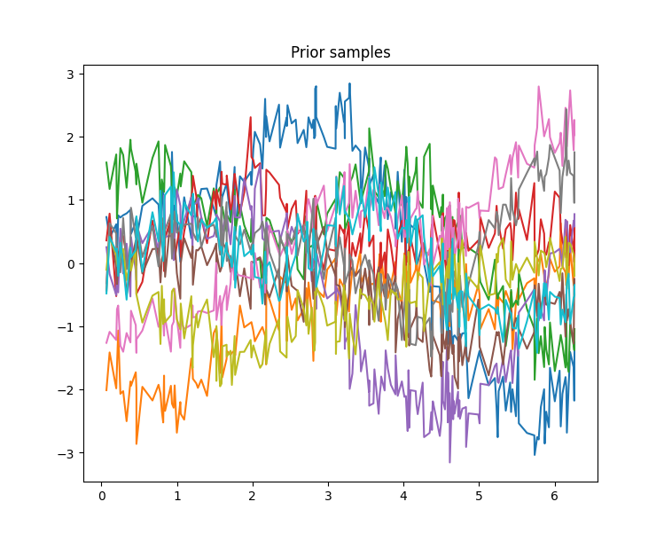
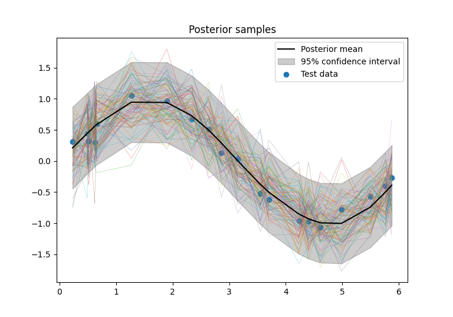
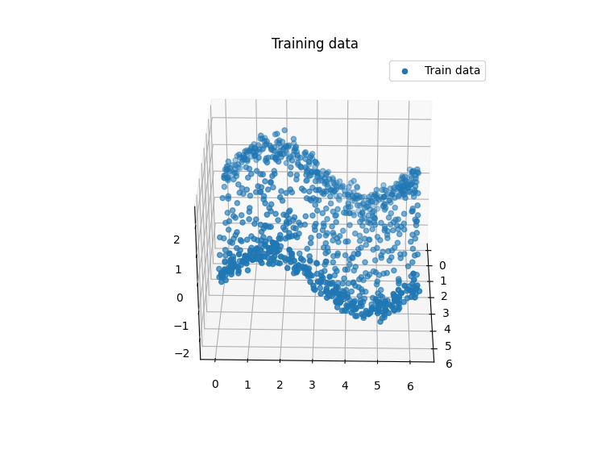
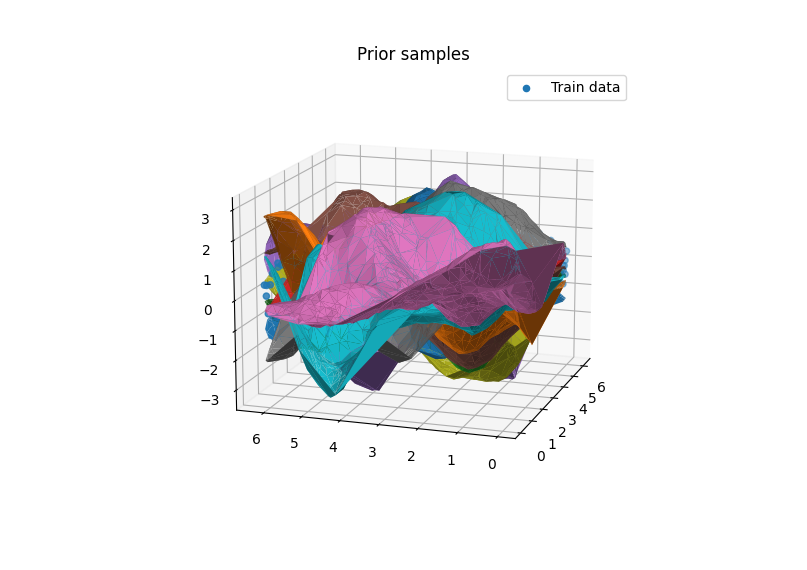
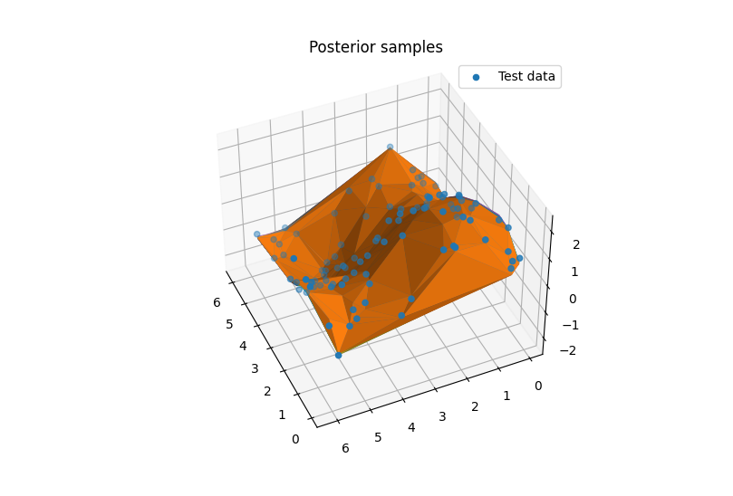

# GaussianProcessRegression
A small intorduction to Gaussian Process Regression (GPR) and its implementation in Python.

Gaussian process regression is a versatile and useful tool for machine learning, since it has good uncertainty measures.

The general approach, is to assume that the data is generated by a Gaussian process, and then use the data to infer the parameters of the Gaussian process. The Gaussian process is a distribution over functions, and is defined by a mean function and a covariance function. The mean function is usually set to zero, and the covariance function is usually a kernel function. The kernel function is a function that takes two inputs, and returns a measure of similarity between the two inputs.

After the parameters of the Gaussian process has been inferred, the Gaussian process can be used to predict the output of new inputs. The Gaussian process will return a mean and a variance for the new inputs. The mean is the most likely output, and the variance is a measure of the uncertainty of the prediction.

**2D: Random samples taken from a prior distribution**

**2D: Random samples taken from a posterior distribution**

*It can be seen, that the posterior distribution is much more constrained than the prior distribution, and follows a sine wave which is the true function.*

**3D: Training data**

**3D: Random samples taken from a prior distribution**

**3D: Random samples taken from a posterior distribution**

