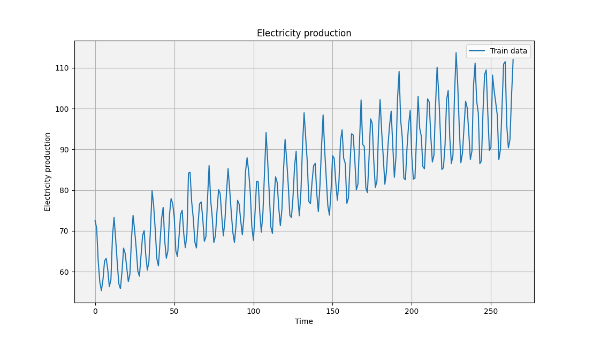

# GaussianProcessRegression
A small intorduction to Gaussian Process Regression (GPR) and its implementation in Python.

GPR is a non-parametric Bayesian regression method, which is very flexible and can be used for any type of data (strings, graphs, etc.). Typically the posterior is calculated using Bayes’ rule, but other optimization methods such as Gradient Descent are also possible.

The main difference (and benefit) of GPR is that it gives the estimated normal distribution for a data point, instead of a single value. This is useful in knowing how confident a prediction is, for example to better gauge the size of an investment.

The main drawback of GPR is its large computational cost, and possibly hard-to-make kernel functions. Calculation of the posterior distribution using Bayes’ rule requires inverting the training data’s kernel/similarity/covariance matrix, which is an O(n^3) operation.

## **Demos**

**Prior distribution**

*Here is a normal distribution. GPR works by assuming that the data points are a sample from a normal distribution, in this case, any sample from the normal distribution corresponds to all the observed data points.*

**Posterior distribution**

*Here is the posterior distribution, which is the distribution of the data points given the prior distribution and the observed data points. The posterior distribution is much more constrained than the prior distribution and likely gives good guesses for the actual data.*

**2D: Random samples taken from a prior distribution**

**2D: Random samples taken from a posterior distribution**

*It can be seen, that the posterior distribution is much more constrained than the prior distribution, and follows a sine wave which is the true function.*

**3D: Training data**

**3D: Random samples taken from a prior distribution**

**3D: Random samples taken from a posterior distribution**

**Fit on artificial data**

*This data was generated by creating a random kernel function, and then sampling from it. To cheat, the same random kernel was used to calculate the prior and posterior guaranteeing a good fit.*

## **Electricity production forecasting**
To see how GPR works on real data (daily electricity production 1985-2018), I used a dataset from Kaggle: https://www.kaggle.com/datasets/kandij/electric-production. Here, the task is to forecast electricity production.

**Electricity production data**

*Training data (66%)*

**Electricity production forecast**

*We see a good potential fit, with the estimated confidence intervals.*

**Electricity production forecast vs test**

*I also calculated the mean absolute error percent, which came out to 3.5%.*

